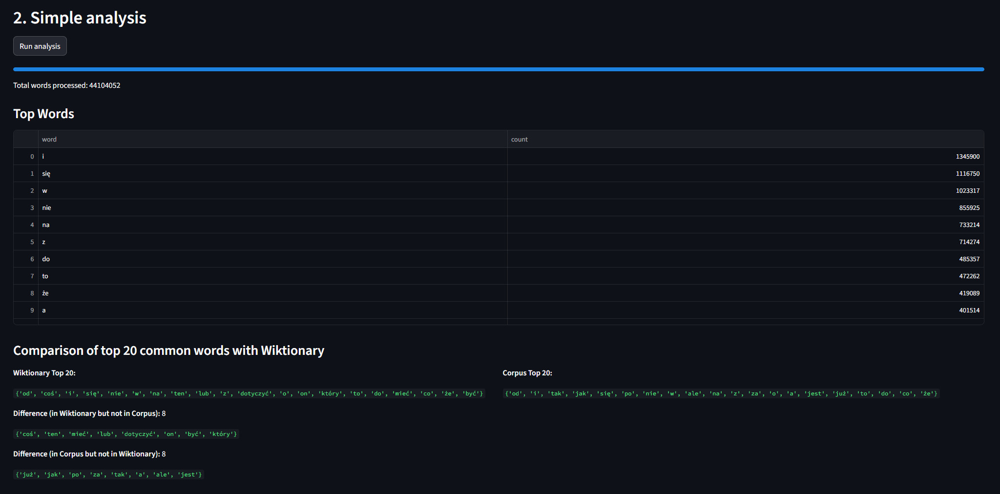
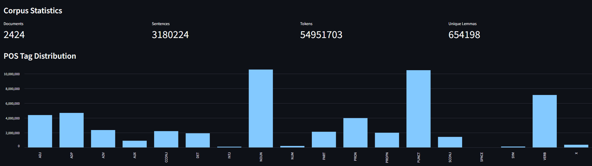
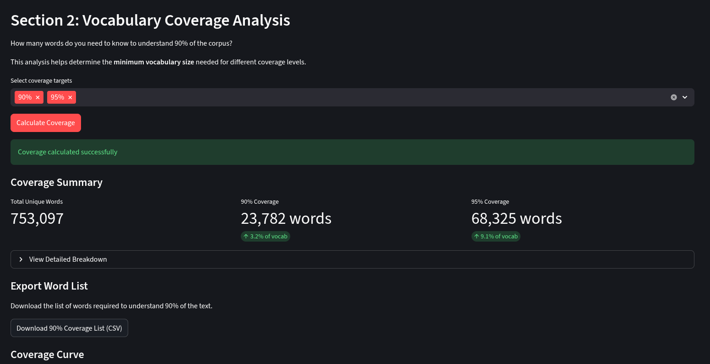
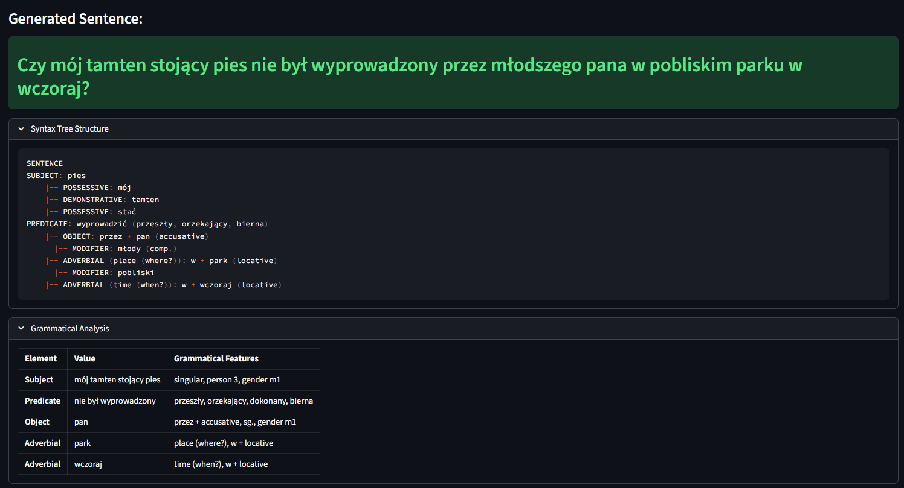
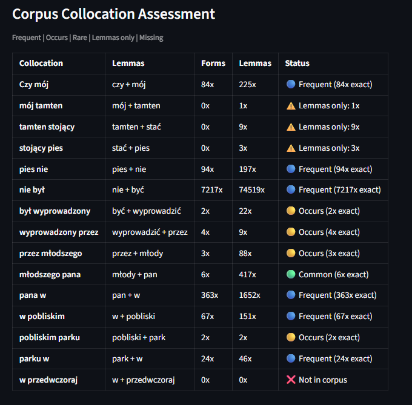
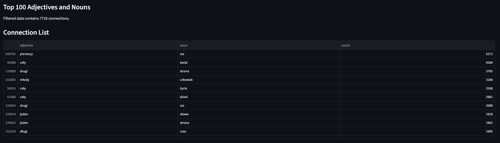
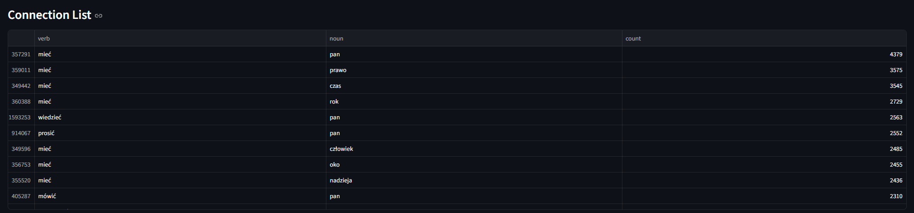
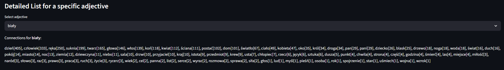
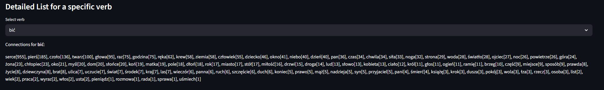

# Przetwarzanie Języka Naturalnego

Jezyk który został wybrany do analizy to język **polski**.

Autorzy:

- Kamil Pustelnik
- Mateusz Mrowiec

## Uruchomienie projektu:

Wymagania wstępne:

- Python 3.11+
- uv (menedżer pakietów)

1. Instalacja zależności:

```bash
uv sync
```

2. Pobranie modelu spaCy dla języka polskiego:

```bash
uv run spacy download pl_core_news_lg
```
(można zainstalować również wersję medium / small modelu)

3. Uruchomienie aplikacji Streamlit:

```bash
uv run streamlit run Home.py
```

Interfejs aplikacji otworzy się w przeglądarce internetowej.

## Elementy projektu

Projekt został podzielony na strony w aplikacji `Streamlit`:

### Pobieranie korpusu z wolnelektury.pl

Strona umożliwia pobranie korpusu tekstów literackich w języku polskim z serwisu wolnelektury.pl.
Do pobrania korpusu wykorzystywano bibliotekę `requests` oraz `BeautifulSoup4` do parsowania stron HTML.
Pobrane książki są zapisywane w katalogu `data/books_source/` w formacie txt. Repozytorium zawiera już pobrany korpus wiec nie ma potrzeby ponownego pobierania. W korpusie znajdują się 2424 książki, a w nich ponad 3 miliony zdań (w tym ok. 55 milionów słów). W zbiorze znajduje się 655 tys. unikalnych lematów.

Strona ta pozwala na przeprowadzenie prostej analizy statystycznej pobranego korpusu, wyswietlająć:

- Liczbe słów w korpusie
- Najczęściej występujące słowa
- Porównanie 20 najczęściej występujących słów w korpusie z 20 najczęściej występującymi słowami w języku polskim (na podstawie danych z [wiktionary](https://en.wiktionary.org/wiki/Wiktionary:Frequency_lists/Polish_wordlist))



### Wstępne przetwarzanie tekstu

Strona odpowiedzialna za wstępne przetwarzanie tekstu, w tym:

- Tokenizacja
- Lematizacja
- Tagowanie części mowy (POS tagging)

Pozwala ona na wczytanie plików tekstowych z katalogu `data/books_source/`, a następnie przetworzenie ich (z wykorzystaniem biblioteki `SpaCy`) i zapisanie wyników w folderze `data/cache/` przetworzonych dokumentów w formatach binarnych potrzebnych do dalszego działania aplikacji.
Odpowiednie przetworzone dane są już zawarte w repozytorium, więc nie ma potrzeby ponownego przetwarzania, jedyne co należy zrobić to wczytać te dane klikając przycisk "Load from Cache".

Strona ta wyświetla również podstawowe statystyki dotyczące przetworzonych dokumentów, takie jak liczba dokumentów, liczba tokenów, liczba unikalnych lematów oraz rozkład części mowy.



### Zadanie 1: Analiza statystyczna

Ta strona pozwala na przeprowadzenie statystycznej analizy korpusu i składa się z następujących elementów:

#### Weryfikacja prawa Zipfa

Przy użyciu unikalnych lematów z korpusu, strona ta generuje wykres częstości występowania słów w skali log-log oraz wykres iloczynu rangi i częstości występowania słów, aby zweryfikować prawo Zipfa. Oblicza również współczynnik nachylenia linii trendu na wykresie log-log. Pozwala również na wyswietlenie najczęściej występujących słów w korpusie.


W wybranym korpusie należy zauważyć, iż prawo Zipfa jest spełnione (warunki są niemal idealne).

#### Pokrycie słownictwa

Oblicza liczbę unikalnych słów potrzebnych do pokrycia określonego procentu korpusu (np. 90%, 95%) oraz generuje wykres pokazujący krzywą pokrycia słownictwa. Pozwala również na eksport listy słów potrzebnych do poznania wybranej części danego jężyka do pliku CSV. Umożliwia również wyszukanie konkretnego słowa i sprawdzenie jego pozycji w rankingu częstości występowania.

Tym samym aby móc zadeklarować znajomość 90% języka polskiego zgodnie z obraną konwencją należy poznać ok. 17 tys. wyrazów.



### Zadanie 2: Kreator zdań

Strona ta pozwala na tworzenie poprawnych gramatycznie zdań poprzez na wybór podmiotu (rzeczownik lub zaimek), orzeczenia (czasownik) oraz dopełnienia (rzeczownik wraz z wyborem elementów tj. przypadku i liczby). Dodatkowo umożliwia wybór czasu (teraźniejszy, przeszły, przyszły) oraz wspiera negacje zdania, tryb pytający i tryb przypuszczający, a także stronę bierną. Do rzeczowników można dodać przymiotniki z opcją wyboru stopnia (równy, wyższy, najwyższy) oraz okoliczniki (wybór typu, rzeczownika, liczby oraz przyimka).
Edytor działa w formie pseudodrzewiastej i umożliwia rozbudowywanie tworzonego działa kolejnymi częściami zdania (przydawkami, dopełnieniami oraz okolicznikami).

Do odpowiednich przekształceń wyrazów wykorzystywana jest biblioteka [Morfeusz2](https://morfeusz.sgjp.pl/), a do sugerowania przypadków dopełnień - [słownik Walenty](https://zil.ipipan.waw.pl/Walenty).

Na podstawie zdania budowane drzewo składniowe oraz wyświetlana jest analiza gramatyczna. Jest również możliwość sprawdzenia jak często użyte kolokacje występują w korpusie, co stanowi wstęp do analizy semantycznej.





### Zadanie 3: Analiza semantyczna

Strona ta umożliwia przeprowadzenie analizy semantycznej korpusu. Pozwala na analizę zestawień typu:

- przymiotnik-rzeczownik
- czasownik-dopełnienie

Wyświetlana jest tabla najczęściej występujących kolokacji oraz generowany jest dwudzielny graf współwystępowania słów.




Istnieje również możliwość wyszukanie połączeń dla wybranego rzeczownika lub czasownika (w zależności od wybranego trybu).



